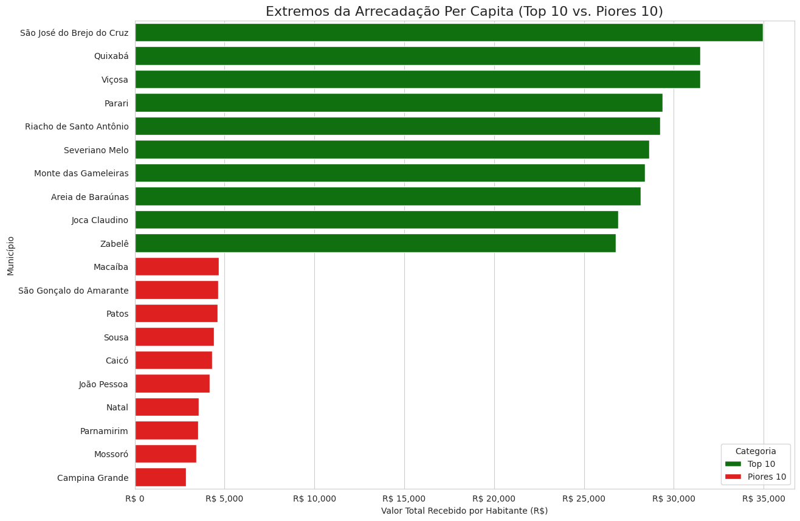
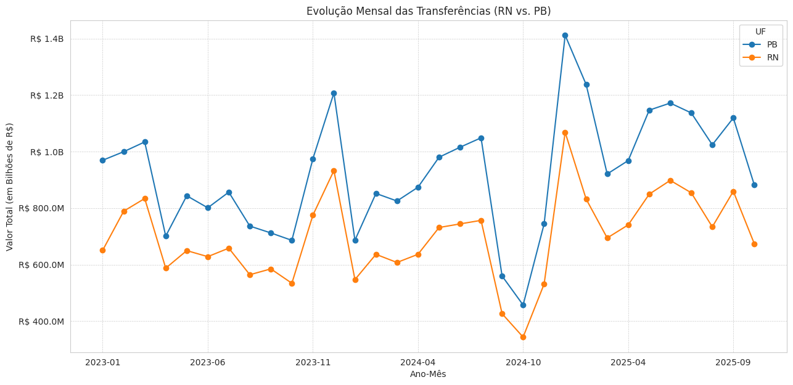
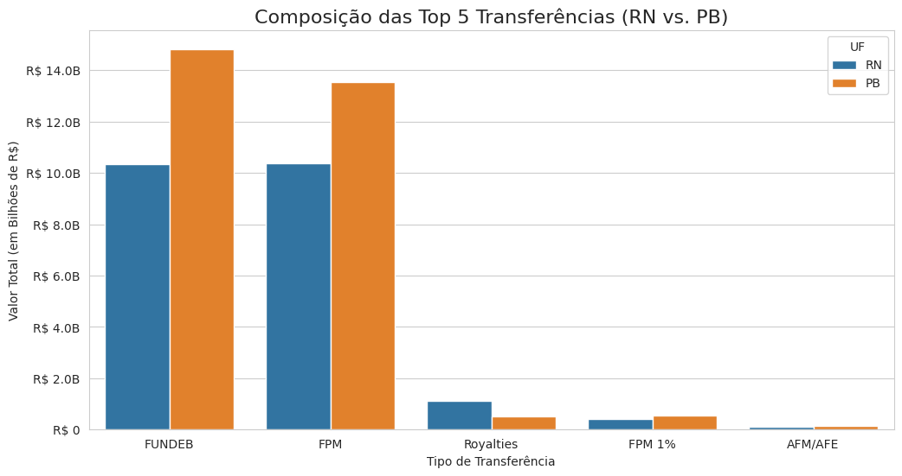

# Análise Quantitativa de Repasses Federais: RN vs. PB (2023-2025)



---

## 1. 🎯 Visão Geral do Projeto

Este projeto é uma análise quantitativa comparativa dos repasses financeiros federais (FPM, FUNDEB, Royalties, etc.) para todos os 390 municípios dos estados do Rio Grande do Norte (RN) e da Paraíba (PB), cobrindo o período de 2023 a 2025.

Seguindo uma metodologia de ciência de dados, a análise parte de perguntas de negócio simples (Quem arrecadou mais?) e avança para *insights* estatísticos mais profundos, revelando a **volatilidade (risco)** das fontes de receita e as **distorções na distribuição per capita** dos recursos.

## 2. 💡 Principais Insights da Análise

Esta análise transformou dados brutos em três níveis de conhecimento:

#### Insight 1: A Paraíba arrecadou R$ 7,2 Bilhões a mais (Valor Absoluto)
A análise macro revelou que a Paraíba (PB) arrecadou **R$ 29.6 bilhões** no período, significativamente mais que o Rio Grande do Norte (RN), que totalizou **R$ 22.4 bilhões**. Essa diferença é em grande parte explicada pela arrecadação superior das capitais, onde João Pessoa (PB) superou Natal (RN).



#### Insight 2: A receita do RN é 1,6x mais arriscada (Análise de Volatilidade)
A análise de composição mostrou que o RN depende mais de Royalties (4.93% da sua receita) que a PB (1.76%). Para quantificar o risco disso, utilizei o **Coeficiente de Variação (CV)**:
* **FPM (PB & RN):** CV de **~28%** (mais estável).
* **Royalties (PB & RN):** CV de **~45%** (mais instável).



**Conclusão:** A receita de Royalties é **1,6 vez mais volátil** que o FPM, tornando o planejamento financeiro dos municípios potiguares mais imprevisível.

#### Insight 3: A "Grande Inversão" (Análise Per Capita)
A análise de valor absoluto se mostrou enganosa. Ao cruzar os repasses com os dados de população do **IBGE (Censo 2022)**, o ranking de riqueza municipal inverteu-se completamente:

* **Menor Receita:** As cidades mais populosas (Natal, João Pessoa, Campina Grande, Mossoró) estão entre as **10 piores** em repasse por habitante.
* **Maior Receita:** Municípios com menos de 2.000 habitantes (como São José do Brejo do Cruz-PB) recebem até **12 vezes mais** verba federal por cidadão (R$ 34.954/hab) do que grandes centros (Campina Grande: R$ 2.866/hab).

Isso demonstra uma distorção significativa na distribuição de recursos, provavelmente ligada às regras de cotas mínimas do FPM.

## 3. 🛠️ Metodologia e Ferramentas

O projeto foi desenvolvido em Python seguindo o Método Estatístico (Formulação, Coleta, Análise, Interpretação).

* **Ferramentas:** Python 3, Pandas, Matplotlib, Seaborn.
* **Análise Descritiva:** Agregações (`groupby`, `sum`) e análise de composição percentual.
* **Análise Estatística:** Medidas de dispersão (Desvio Padrão) e risco relativo (Coeficiente de Variação) aplicadas a séries temporais.
* **Enriquecimento de Dados (Merge):** Junção de dados financeiros (Fonte Primária) com dados demográficos (Fonte Secundária - IBGE) para criar a análise *per capita*.
* **Tratamento de Dados:** Interpolação linear de dados mensais ausentes (Set/2024) para permitir a análise de volatilidade.

## 4. 📂 Estrutura do Repositório

* **/analise_repasses_uniao_rn_pb.ipynb**: O notebook Jupyter contendo todo o código e a análise detalhada (passo a passo).
* **/dados/**:
    * [Acesse o dados brutos no site do Tesouro Transparente (Gov)](https://www.tesourotransparente.gov.br/ckan/dataset/transferencias-constitucionais-para-municipios) .
    * [Acesse o dados já tratados no Kaggle](https://www.kaggle.com/code/jadsonchagas/analise-repasses-uniao-rn-pb) .
    * Os dados de população do Censo 2022 estão embutidos no notebook.

## 5. 🚀 Como Executar o Projeto

1.  Clone este repositório.
2.  Instale as dependências:
    ```bash
    pip install pandas numpy matplotlib seaborn
    ```
3.  **Importante:** Faça o download do arquivo de dados principal (não incluído neste repositório devido ao tamanho) e atualize o `FILE_PATH` no notebook.
4.  Execute o notebook `analise_repasses_uniao_rn_pb.ipynb`.
